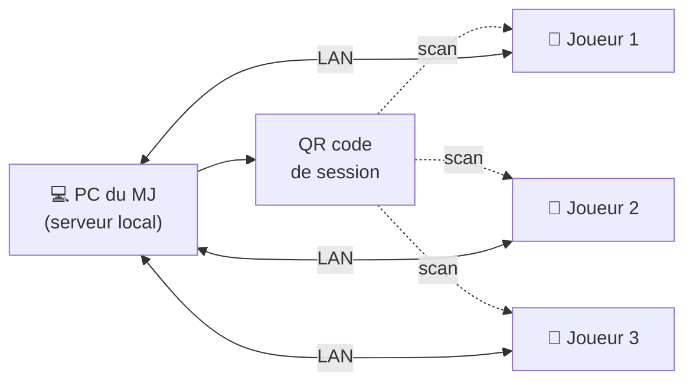

# Jdr Assistant

> Un compagnon de table pour le jeu de rôle en présentiel : il s'ajoute à la partie, il ne la remplace pas.

## Pourquoi

Les outils de JdR actuels digitalisent tout : gestion des règles, calculs, jets de dés, fiches… Ils finissent par remplacer la table.

**Jdr Assistant** prend le parti inverse. Les dés restent physiques, les règles restent dans la tête des joueurs et du MJ. L'outil se contente de fluidifier ce qui est pénible en présentiel : consulter et tenir à jour les fiches, partager rapidement une information, communiquer discrètement.

## Principe : un outil asymétrique

| Appareil | Rôle | Usage |
|---|---|---|
| 💻 PC | Maître du jeu — **serveur** | Vue d'ensemble de toutes les fiches, gestion de la session |
| 📱 Mobile | Joueur — **client** | Consultation et mise à jour de sa propre fiche |

Le PC lance un serveur local. Les joueurs rejoignent la session en scannant un **QR code** affiché par le MJ, et se connectent via le réseau local (LAN / peer-to-peer). Aucun service en ligne n'est nécessaire.

## Fonctionnalités

### Fiches synchronisées

- Chaque joueur voit sa fiche personnage sur son téléphone.
- Le MJ voit l'ensemble des fiches.
- L'état est synchronisé en temps réel : si un joueur ou le MJ retire des points de vie, tout le monde voit la fiche à jour.

### Ping d'informations

Un joueur ou le MJ peut envoyer un élément (objet, compétence, sort…) aux autres pour le mettre en avant.

> *Joueur : « J'utilise mon épée magique. »* → ping → le MJ voit immédiatement les caractéristiques et bonus de l'épée.

### Messages privés

Un chat basique pour échanger discrètement entre joueurs et MJ.

> *Joueur → MJ : « Je vais attaquer ce joueur dans le dos. »*

## Hors périmètre

L'outil ne remplace pas la table, donc volontairement **pas** de :

- jets de dés automatiques ;
- calculs automatiques (les valeurs dérivées, comme les modificateurs, sont saisies à la main) ;
- gestion de règles poussée.

## Système modulaire

L'outil n'est lié à aucun système de jeu. Le support d'un système passe par des **modules**, installables à chaud sur le PC comme sur les mobiles.

Un module n'apporte que des **interfaces** : il ne contient pas de logique de règles.

- **Le cœur** définit des types généraux : `Entity`, `Item`…
- **Les modules** définissent des sous-types et leurs interfaces.

Exemple avec le module **D&D**, premier système supporté :

| Type du cœur | Sous-types définis par le module D&D |
|---|---|
| `Entity` | PJ, PNJ, Adversaires… |
| `Item` | Armes, Consommables, Feats, Sorts… |

## Stack technique

- **Kotlin Multiplatform (KMP)** pour partager le code entre le PC et les mobiles.
- Première version : **client lourd**, avec serveur local sur le PC du MJ.

## Statut

🚧 Phase de conception.
