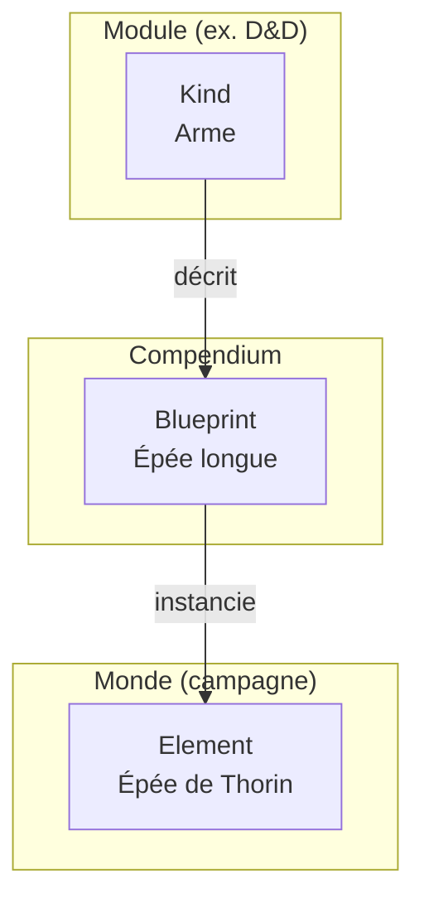
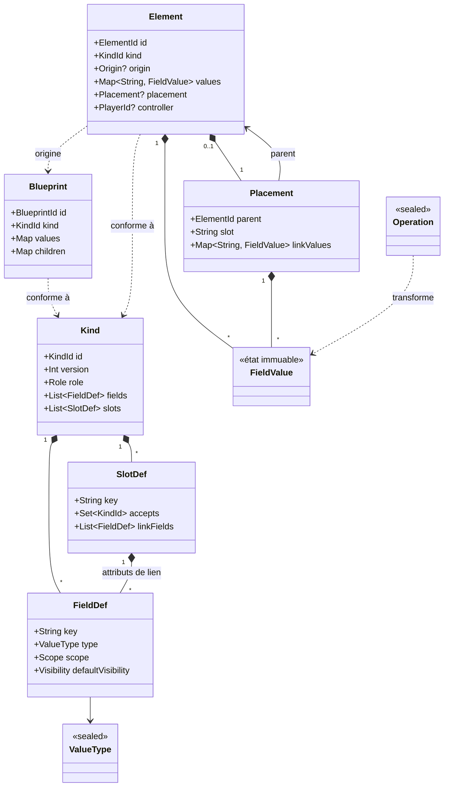
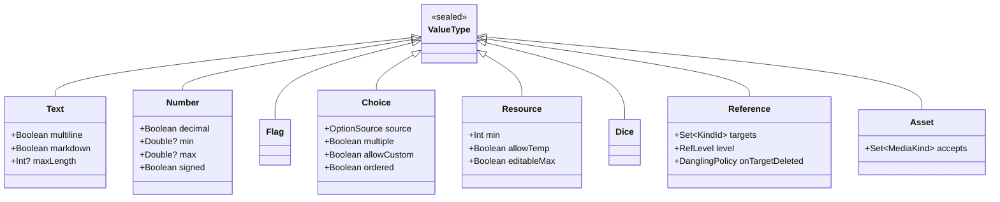
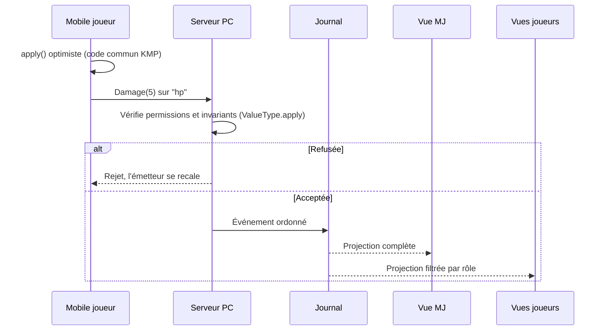

# Jdr Assistant — Conception du core

> Document de travail. Il distingue trois statuts :
> **Décidé** (validé explicitement), **Proposé** (piste retenue en discussion, à confirmer) et **Ouvert** (question non tranchée).

## 1. Objectif du core

Le core fournit un modèle générique capable de représenter les fiches, objets, sorts, capacités, etc. de n'importe quel système de JdR, sans embarquer de règles. Les systèmes (D&D en premier) sont apportés par des **modules déclaratifs**.

Le core ne calcule rien à la place du MJ : il stocke, valide la structure des données, synchronise et affiche.

## 2. Décisions

| # | Sujet | Statut | Décision |
|---|-------|--------|----------|
| D1 | Définition / instance | **Décidé** | Une définition est un squelette réutilisable (ex. « Épée longue »). Une instance est une copie dotée d'un cycle de vie (ex. l'épée de Thorin). |
| D2 | Composition | **Décidé** | Un élément porte des valeurs et peut contenir des sous-éléments. Un objet peut vivre seul ou à l'intérieur d'un autre élément. |
| D3 | Valeurs riches | **Décidé** | Les valeurs sont des modèles objet. Le core définit les types de valeurs, qui portent leur fonctionnement (opérations, invariants) et leur état. |
| D4 | Element dans le core | **Décidé** | `Element` est une classe générique du core. |
| D5 | Modules déclaratifs | **Décidé** | Un type comme « PJ » est une **déclaration** du module (données), pas une sous-classe Kotlin. Les modules ne contiennent pas de code compilé. |
| P1 | Trois niveaux | Proposé | Type (`Kind`, fourni par le module) → définition (`Blueprint`, compendium) → instance (`Element`, monde). |
| P2 | Modèle unifié | Proposé | Une seule structure (`Element`) ; la distinction « Actor / Item » est un **rôle** porté par le `Kind`, pas deux modèles distincts. |
| P3 | Slots et attributs de lien | Proposé | Les enfants sont rangés dans des slots typés (inventaire, sorts, capacités…). Les attributs de la relation (équipé, préparé, quantité) sont portés par le `Placement`, pas par l'objet. |
| P4 | Opérations typées | Proposé | Toute modification passe par une opération sémantique (`Damage(5)` plutôt que `Set(12)`), validée et ordonnée par le serveur PC, puis journalisée. |
| P5 | Projections | Proposé | Chaque client reçoit une vue de l'état filtrée par son rôle (asymétrie MJ / joueurs). |
| P6 | Pas de valeurs dérivées | Proposé | Pas de type « formule » : il imposerait un langage d'expressions, porte d'entrée d'un moteur de règles. |

## 3. Vocabulaire (noms provisoires)

| Terme | Rôle | Où |
|-------|------|----|
| `Kind` | Schéma d'un type : rôle, champs, slots | Déclaré par un module |
| `FieldDef` | Déclaration d'un champ : clé, `ValueType` + configuration, scope | Dans un `Kind` |
| `SlotDef` | Collection d'enfants typés + attributs de lien | Dans un `Kind` |
| `ValueType` | Type de valeur : configuration, état, opérations | Core |
| `FieldValue` | État d'un champ dans une instance | Core |
| `Blueprint` | Définition réutilisable | Compendium (module ou homebrew MJ) |
| `Element` | Instance vivante | Monde / campagne |
| `Placement` | Lien parent → enfant dans un slot | Monde / campagne |
| `Operation` | Commande typée modifiant une valeur ou la structure | Core |

> Les noms `Kind`, `Blueprint` et `Element` restent ouverts au débat (alternatives évoquées : `Archetype`, `Prototype`, `Template`, `Document`, `Actor` / `Item`).

## 4. Les trois niveaux



Les trois niveaux ont des cycles de vie différents :

- **Kind** : livré et versionné avec le module, évolue rarement ;
- **Blueprint** : donnée éditable (compendium du module ou homebrew du MJ) ;
- **Element** : état vivant, modifié en permanence pendant la session.

## 5. Répartition du code

```mermaid
flowchart LR
    subgraph Core["Core (Kotlin, commonMain)"]
        direction TB
        Kind
        FieldDef["FieldDef / SlotDef"]
        ValueType
        FieldValue
        Blueprint
        Element
        Placement
        Operation
    end
    subgraph DnD["Module D&D (déclaratif)"]
        direction TB
        KPJ["Kind PJ"]
        KPNJ["Kind PNJ"]
        KArme["Kind Arme"]
        KSort["Kind Sort"]
        SRD["Blueprints SRD"]
        Layouts["Layouts de fiche"]
    end
    subgraph Apps["Apps KMP (PC et mobile)"]
        direction TB
        Serveur["Serveur + journal"]
        Rendu["Rendu générique"]
        Chargeur["Chargeur de modules"]
    end
    DnD -- "utilise les types du core" --> Core
    Core --> Apps
```



- **Core** : code Kotlin écrit une seule fois.
- **Module** : données exprimées avec les types du core, chargeables à chaud (contrainte iOS : pas de code téléchargé exécutable).
- **Apps** : ne connaissent que le core. Elles affichent une fiche PJ sans savoir ce qu'est un PJ, en lisant les `FieldDef`, `SlotDef` et layouts du module.

Exemple de déclaration côté module (le DSL n'est qu'un outil d'écriture, le résultat est sérialisé) :

```kotlin
val weapon = kind("dnd5e:weapon", role = Role.ITEM) {
    field("damage", Dice, scope = INTRINSIC)
    field("properties", Text(), scope = INTRINSIC)
}

val playerCharacter = kind("dnd5e:pc", role = Role.ACTOR) {
    field("hp", Resource(allowTemp = true), scope = STATE)
    group("abilities") {
        listOf("str", "dex", "con", "int", "wis", "cha")
            .forEach { field(it, Number(min = 1.0, max = 30.0)) }
    }
    slot("inventory", accepts = setOf(weapon)) {
        link("equipped", Flag)
        link("quantity", Number(min = 1.0))
    }
}
```

Une façade typée optionnelle reste possible pour un module embarqué (tests, écran spécifique), sans changer le modèle :

```kotlin
@JvmInline
value class PlayerCharacter(val element: Element) {
    val hp get() = element.resource("hp")
}
```

## 6. Modèle de classes du core



Notes :

- **Scope d'un champ** : `INTRINSIC` (vient de la définition : dégâts, description) ou `STATE` (n'existe que dans l'instance : charges restantes, PV actuels).
- **Composition vs référence** : un sac *contient* une corde (composition, un seul parent, via `Placement`) ; un parchemin *référence* un sort (type de valeur `Reference`).
- **Objet libre** : un `Element` sans `Placement`, ou placé dans un Element « Lieu » / « Réserve ».
- **Empilement** : 50 flèches = une instance avec une quantité, nécessitant des opérations `Split` / `Merge`.

## 7. Types de valeurs

Chaque `ValueType` se décompose en trois parties :

- **configuration** : déclarée dans le `FieldDef` par le module (bornes, options, multiplicité…) ;
- **état** : porté par l'instance, immuable (chaque opération produit un nouvel état) ;
- **opérations** : seules façons légitimes de faire évoluer l'état ; elles garantissent les invariants.

```kotlin
interface ValueTypeBehavior<C : Any, S : Any, O : Any> {
    fun initial(config: C): S
    fun apply(state: S, op: O, config: C): Result<S>
}
```

L'ensemble des types est **fermé** (hiérarchie scellée dans le core) : un module compose des types connus, ce qui permet au mobile d'afficher n'importe quel module sans code supplémentaire.

### Catalogue

| Type | Statut | Configuration envisagée | Exemples D&D |
|------|--------|-------------------------|--------------|
| `Text` | **Décidé** | `multiline`, `markdown`, `maxLength` | Nom, notes, description de sort |
| `Number` | **Décidé** | entier / décimal, bornes, affichage signé | Caractéristiques, CA, poids |
| `Flag` (booléen) | **Décidé** | — | Inspiration, harmonisé |
| `Choice` | **Décidé** | source des options, `multiple`, `allowCustom`, `ordered` | Alignement, langues, maîtrise (aucune / demi / maîtrise / expertise) |
| `Resource` | **Décidé** | `min`, max, temporaire, reset | PV, emplacements de sorts, charges, jets contre la mort |
| `Dice` | Proposé | — | Dégâts, dés de vie |
| `Reference` | Proposé | cibles (Kinds), niveau (Blueprint / Element), politique si cible supprimée | Parchemin → sort, familier → maître |
| `Asset` | Proposé | types de média acceptés | Portrait, jeton, illustration |



Exemple d'opérations pour `Resource` :

```kotlin
data class ResourceState(val current: Int, val max: Int, val temp: Int = 0)

sealed interface ResourceOp {
    data class Damage(val amount: Int) : ResourceOp  // consomme temp puis current
    data class Heal(val amount: Int) : ResourceOp    // plafonné à max
    data class SetTemp(val amount: Int) : ResourceOp
    data class SetMax(val max: Int) : ResourceOp
    data object Reset : ResourceOp                    // repos
}
```

### Ce qui n'est pas un type (proposé)

- **Cases à cocher / pastilles** : une `Resource` à petit max ; l'affichage relève du layout.
- **Texte riche** : configuration de `Text`.
- **Groupe** (caractéristiques, monnaie) : regroupement de champs dans le `Kind`, pas un type de valeur — la synchronisation reste au niveau du champ.
- **Valeur dérivée / formule** : exclue (voir P6).

### Frontière avec les règles

Le comportement **structurel** d'un type vit dans le core (les PV ne descendent pas sous le minimum, les dégâts consomment d'abord le temporaire). Les **règles du système** n'y vivent pas (une résistance divise les dégâts par deux) : elles restent l'affaire du MJ.

## 8. Flux d'une opération (proposé)



Apports attendus :

- **Commutativité** : deux `Damage` concurrents se composent ; deux `Set` s'écrasent.
- **Historique** lisible (« Thorin : −5 PV par le MJ »), undo, rejeu à la reconnexion.
- **Application optimiste** côté mobile avec la même fonction pure que le serveur.

## 9. Composants à prévoir (proposé)

- **Visibilité / permissions** par champ et par instance (objet non identifié, piège caché) ; le mobile ne reçoit jamais l'état complet.
- **Compendium** : stockage des Blueprints (module + homebrew).
- **Monde / campagne** : conteneur des instances, frontière de sauvegarde et de sync.
- **Adressage** stable (`elementId` + chemin de champ) pour le ping.
- **Layout** séparé du schéma.
- **Format du paquet de module** : manifeste (id, version, version du core visée, dépendances) et migrations des Kinds.

## 10. Questions ouvertes

1. **Noms définitifs** : `Kind` / `Blueprint` / `Element`, rôles `Actor` / `Item` ?
2. **Définition → instance** : copie complète (snapshot + provenance) ou prototype (l'instance ne stocke que ses overrides) ? Impacte le stockage, la sync et la propagation d'un homebrew modifié.
3. **Resource** : le max est-il fixé par la définition ou fait-il partie de l'état modifiable par le joueur ?
4. **Dice, Reference, Asset** : à intégrer au catalogue initial ?
5. **Blueprints composés** (ex. paquetage d'explorateur) : à l'instanciation, garder le conteneur ou l'éclater dans l'inventaire ?
6. **Monnaie** : groupe de `Number` sur l'Actor ou objets empilables transférables ?
7. **Permissions d'écriture** : quels champs un joueur peut-il modifier lui-même ?
8. **Cas limites** hors périmètre initial : forme sauvage / métamorphose.
